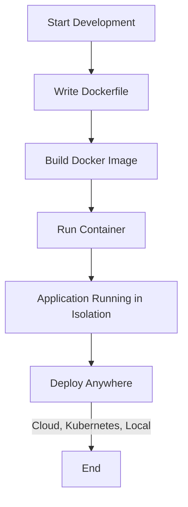

# 🐳 Docker Development Workflow

## 📖 Table of Contents
1. [📌 Introduction](#-introduction)
2. [📝 Understanding the Workflow](#-understanding-the-workflow)
   - [🔹 Step 1: Containerizing an Application](#-step-1-containerizing-an-application)
   - [🔹 Step 2: Writing a Dockerfile](#-step-2-writing-a-dockerfile)
   - [🔹 Step 3: Building an Image](#-step-3-building-an-image)
   - [🔹 Step 4: Running a Container](#-step-4-running-a-container)
   - [🔹 Step 5: Deploying Anywhere](#-step-5-deploying-anywhere)
3. [📊 Mermaid Diagram](#-mermaid-diagram)
4. [🚀 Conclusion](#-conclusion)
5. [📚 Further Reading](#-further-reading)

---

## 📌 Introduction
Docker streamlines the **development workflow** by allowing developers to package applications into **isolated containers**. This ensures consistency across different environments, whether on a local machine or in production.

---

## 📝 Understanding the Workflow

### 🔹 Step 1: Containerizing an Application
Regardless of the type of application, Docker allows us to **containerize it** by defining a set of instructions in a **Dockerfile**. This ensures:
- A controlled and predictable environment.
- The ability to run applications consistently across various systems.

### 🔹 Step 2: Writing a Dockerfile
A **Dockerfile** is a plain text file that contains a list of instructions for Docker to package an application into an **image**. This image includes everything needed to run the application, such as:
- The base OS and runtime.
- Application source code.
- Dependencies and libraries.
- Configuration files.

### 🔹 Step 3: Building an Image
Once the **Dockerfile** is ready, we build a Docker image using:
```sh
docker build -t my-app .
```
This command generates a self-contained **image** that can be used to create containers.

### 🔹 Step 4: Running a Container
With the image built, we run it inside a container:
```sh
docker run -p 3000:3000 my-app
```
- The application now runs inside an **isolated container**.
- We interact with the application as if it were running natively.

### 🔹 Step 5: Deploying Anywhere
Since the application is now containerized, we can deploy it anywhere, including:
- Local development machines.
- Cloud providers like AWS, Azure, or GCP.
- Kubernetes clusters for large-scale deployment.

---

## 📊 Diagram
Below is a **diagram** representing this workflow visually:



This diagram shows how an application moves from **development** to being **containerized and deployed** anywhere. 🚀🐳

---

## 🚀 Conclusion
Using Docker in the **development workflow** ensures applications run consistently across environments. By containerizing applications, developers avoid the infamous "works on my machine" problem.

🚀 **Now, let’s see this workflow in action!**

---

🛠️ **Happy Coding with Docker!** 🐳

